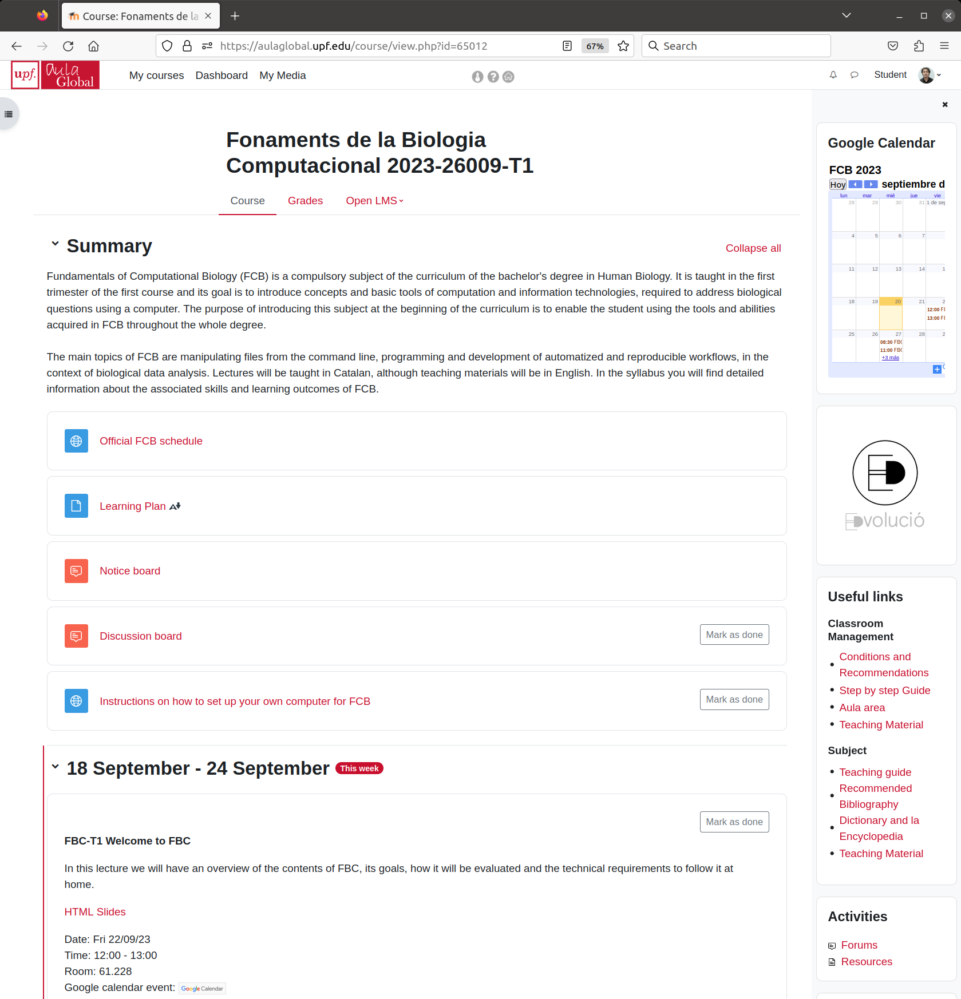

```{r setup, include=FALSE, cache=FALSE}
options(htmltools.dir.version = FALSE, width=80)
knitr::opts_chunk$set(warning = FALSE, message = FALSE, cache=TRUE)

## from http://yihui.name/knitr/hooks#chunk_hooks
knitr::knit_hooks$set(small.mar=function(before, options, envir) {
                                              if (before) par(mar=c(4, 5, 1, 1)) ## smaller margin on top and right
})
```

class: title-slide, middle, center

# Fundamentals of Computational Biology

## Robert Castelo
[robert.castelo@upf.edu](mailto:robert.castelo@upf.edu)
### Dept. of Experimental and Health Sciences
### Universitat Pompeu Fabra

### BSc on Human Biology
### UPF School of Health and Life Sciences
### Academic Year 2021-2022

---

class: split-three, center

# Instructors

.column[
  <br> 
  <br> 
  <br> 
  
  Ricard Argelaguet  
  [Babraham Institute, UK](https://www.babraham.ac.uk/people/member/891)
  [`r icons::icon_style(icons::fontawesome("twitter"), fill="#1DA1F2")`](https://twitter.com/rargelaguet)
  statistical methods for single-cell multi-omics data
]
.column[
  <br> 
  <br> 
  <br> 
  
  Robert Castelo  
  [DCEXS-UPF](https://functionalgenomics.upf.edu/people/rcastelo)
  [`r icons::icon_style(icons::fontawesome("twitter"), fill="#1DA1F2")`](https://twitter.com/robertclab)  
  statistical & bioinformatic methods for genomics data
]
.column[
  <br>
  <br>
  <br>
  
  Mireia Ramos  
  [DCEXS-UPF](https://www.upf.edu/web/endocrine-regulatory-genomics/adscripcion/-/-/185253/adscripcion/mireia-ramos)
  [`r icons::icon_style(icons::fontawesome("twitter"), fill="#1DA1F2")`](https://twitter.com/mireia_bioinfo)  
  bioinformatic methods in molecular genetics,
  [@RLadiesBCN](https://twitter.com/RLadiesBCN) organizer
]

---

# Computational biology

* [Computational biology](https://en.wikipedia.org/wiki/Computational_biology)
  is the study of biology using computation.

* Computational biology **is** biology, because the word _computational_ is an
  adjective.

* Fundamentals of Computational Biology (FCB) will introduce to you concepts
  and basic tools of computation and information technologies, required to
  address biological questions using a computer.

* The purpose of introducing this subject at the beginning of the curriculum is
  to enable the student using the tools and abilities acquired in FCB throughout
  the whole degree.

---

# Course topics

* The main topics of FCB are:

  * Manipulating files from the command line.
  * Programming and data exploration.
  * Development of automatized and reproducible workflows, in the context of
    biological data analysis.

* These skills are highly and increasingly appreciated in academic and
  industrial environments from the life sciences.

* Your CV can grow with every technique, tool or platform that you will learn
  to use in FCB.

---

# Course structure

* All sessions will be _in-person_ unless COVID19 restrictions are enforced
  by health authorities. In such a case we will go online-synchronous by
  videocall (Zoom and/or Google Meet).
* There will be no _hybrid_ sessions, i.e., simultaneously _in-person_ and
  _online_, unless one or more students are quarantined for COVID19.
* Some recorded materials from last year will be available, but part of
  those contents may change through this edition of the course.


---

# Course workload

* One single group-class for lectures (~ 60 students/group), two for seminars
  (~ 30 students/group), four for practicals (~ 15 students/group)

* One ECTS (~ 25hrs) throughout 10 weeks:
  * 3 hrs of lectures
  * 2 hrs of seminars
  * 2 hrs of practicals
  * 16 hrs of out-of-class work (study, assignments, etc.)

* FCB has 5 ECTS, 125hrs in 10 weeks (~ 12 hr/week). Because of the learning
  goals of FCB, we reduce 4 hrs of lectures to have one more seminar:
  * **11** lectures = 11 hrs
  * **6** seminars x 2 hrs = 12 hrs
  * **10** practicals x 2 hrs = 20 hrs
  * 43 hrs of class time work (~ 4 hrs/week)
  * 82 hrs of out-of-class time work (~ 8 hrs/week)

---

# Course evaluation

* Continuous (60%) + final (40%) over a total of 10 points.

* Continuous evaluation:
  * Seminars through a test on programming problem solving (1 point on the final
    grade): **November 5th, 09:45-11:00**
  * Practicals through the submission of computer assignments (2 points on the
    final grade): ~ 8 assignments, one week submission period, penalty for late
    submissions.
  * Data analysis project (3 points on the final grade): ~ 14hrs work including 2
    seminars, submission deadline ~Dec 5th, penalty for late submissions.

---

# Course evaluation

* Final evaluation:
  * Multiple-choice written exam ("PEM" in its Catalan acronym) for 50% of the final
    evaluation.
  * Open written exam ("Assaig" in Catalan) for 50% of the final evaluation.

* To pass FCB at the end of the term, the student must:
  1. Obtain a minimum grade of 4/10 in the average evaluation of seminars and
     practicals.
  2. Obtain a minimum grade of 4/10 in the evaluation of the data analysis
     project.
  3. Obtain a minimum grade of 4/10 in the final evaluation.

* Remedial exam on July for the final (40%) evaluation. **It is not possible**
  to retake the continuous evaluation.

* Even if you make a perfect July remedial exam, you won't pass FCB if you have
  not scratched at least 1 of the 6 points of the continuous evaluation.

---

# Course evaluation

* You should do the assignments **on your own**. You may ask questions on the
  Slack workspace, but you should not copy the assignment from a classmate.
 
* Data analysis projects can be done individually or in teams of two people
  (encouraged).

* The exam on programming problem solving will be **individual and in person**.

* The final open written exam will be **individual and in person**.

* The final multiple-choice written exam will be **individual and in person**.

* You won't be able to pass FCB without sufficiently performing on the exams
  that you take **individually and in person**.

* The best way to prepare yourself for those exams is to do the assignments on
  your own and work the project hand-in-hand with your mate.

* Your goal shouldn't be to reach a specific mark, it should be **learning**.

---

# Software tooling

* You need to install in your computer the following software tools:
  * Unix shell: by Practical 1 on September 29th.
  * Text editor: by Practical 2 on October 5th.
  * Git version-control system: by Practical 3 on October 11th.
  * Python and Jupyter Notebook: by Practical 4 and October 14th.
  * R and RStudio Notebook: by Practical 7 on November 3rd.

* You will find full instructions at https://funcompbio.github.io/setup

* The first two practicals will take place in the computer room 61.303, which
  will be prepared with the necessary software.

* The rest of the practicals (P3 starting on October 11th) will take place in
  a regular room 61.212 with sockets to let you plug your laptop.

* You'll need to bring your laptop with the software installed and the
  WiFi connection configured (see https://guiesbibtic.upf.edu/eduroam).

* The library has a service that allows students to borrow a laptop.

---

# Social-media productivity profiles

* We will be using two social-media productivity platforms:
[GitHub](https://github.com) and [Slack](https://slack.com).

* You will need to create a profile in each of these platforms
(instructions will follow) using your UPF student email
address.

* It is **very important** that you check and use your UPF
student email address for any communication related to FCB.

* Important announcements, deadlines, etc. related to FCB
will only occur through your UPF student email address and
the FCB Moodle site.

* GitHub and Slack are tools to facilitate the achievement
of the learning goals of FCB, but do not replace the UPF
student email and FCB Moodle site for official communications.

---

# Social-media productivity profiles - GitHub

* **GitHub** is a provider of hosting for software
development and version control using Git.

* The UPF has recently become a partner school of its
[education program](https://education.github.com),
which will give us benefits in using
[GitHub Classroom](https://classroom.github.com)
for submitting and correcting assignments from practicals.

* **All assignments submited through GitHub will be privately stored** under
the GitHub organization repository
[https://github.com/funcompbio2021](https://github.com/funcompbio2021)
and **your public GitHub profile can stay completely empty**.

* Your GitHub account can become a productive and powerful platform for
your computational biology work: **keep it alive throughout the degree**.

* You may consider using it to store some of your student
assignments/projects, make them even public and make even
your own professional profile; see, for instance
[https://kellyjwallace.github.io](https://kellyjwallace.github.io)
or
[https://dieuwkehupkes.github.io](https://dieuwkehupkes.github.io),
and
[https://academicpages.github.io](https://academicpages.github.io)
for a template to create your own personal website.

---

# Social-media productivity profiles - GitHub


---

# Social-media productivity profiles - Slack

* **Slack** is a messaging platform that allows one to organize messages
by topic, is all searchable, facilitates sending code and attachments and
integrates with other platforms, including
[Google G Suite](https://gsuite.google.com/slack) and
[GitHub](https://slack.github.com).

* The UPF offers a Slack workspace called _upfbarcelona_ for all members of the
  UPF community; see
  [https://guiesbibtic.upf.edu/slack](https://guiesbibtic.upf.edu/slack).

* We have a Slack workspace for FCB called _fcb2021upf_ associated with the URL:
  [https://fcb2021upf.slack.com](https://fcb2021upf.slack.com), but
  **it has no public profiles**.


---

# Social-media productivity profiles - Slack


---

# Moodle site

* The Moodle site of FCB will be the entry point for all materials and activities.



---

# GitHub site

* The GitHub site of FCB at
  [https://funcompbio.github.io](https://funcompbio.github.io) will store the
  materials (lectures, seminars and practicals), which will be linked from the
  Moodle site.


---

class: middle, center

# Questions !?
