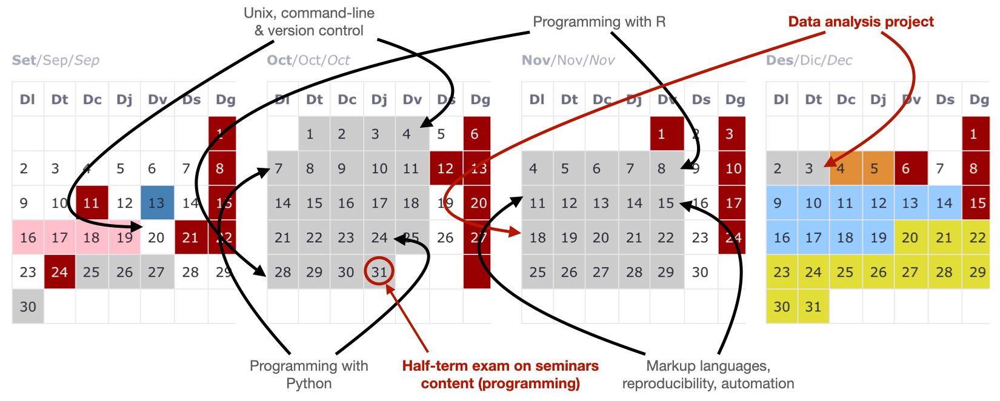

```{r setup, include=FALSE, cache=FALSE}
options(htmltools.dir.version = FALSE, width=80)
knitr::opts_chunk$set(warning = FALSE, message = FALSE, cache=TRUE)

## from http://yihui.name/knitr/hooks#chunk_hooks
knitr::knit_hooks$set(small.mar=function(before, options, envir) {
                                              if (before) par(mar=c(4, 5, 1, 1)) ## smaller margin on top and right
})
```

class: title-slide, middle, center

# Fundamentals of Computational Biology

## Robert Castelo
[robert.castelo@upf.edu](mailto:robert.castelo@upf.edu)
### Dept. of Medicine and Life Sciences
### Universitat Pompeu Fabra

### BSc on Human Biology
### UPF School of Health and Life Sciences
### Academic Year 2024-2025

---

class: split-four, center, font18px

# Instructors

.pull-left[
  <br> 
  <br> 
  <br> 
  
  Robert Castelo  
  [MELIS-UPF](https://functionalgenomics.upf.edu/people/rcastelo)
  [`r icons::icon_style(icons::fontawesome("twitter"), fill="#1DA1F2")`](https://twitter.com/robertclab)  
  [robert.castelo@upf.edu](mailto:robert.castelo@upf.edu)  
  (coordinator)  
  statistical & bioinformatic methods for genomics data
]
.pull-right[
  <br> 
  <br> 
  <br> 
  
  José Carlos Montañés  
  [HMRIB](https://es.linkedin.com/in/jos%C3%A9-carlos-monta%C3%B1%C3%A9s-121b30105)  
  evolutionary genomics of de novo and duplicated genes
]

---

# Computational biology

* [Computational biology](https://en.wikipedia.org/wiki/Computational_biology)
  is the study of biology using computation.  
  &nbsp;&nbsp;
* Computational biology **is** biology, because the word _computational_ is an
  adjective.  
  &nbsp;&nbsp;
* Fundamentals of Computational Biology (FCB) will introduce to you concepts
  and basic tools of computation and information technologies, required to
  address biological questions using a computer.  
  &nbsp;&nbsp;
* The purpose of introducing this subject at the beginning of the curriculum is
  to enable the student using the tools and abilities acquired in FCB throughout
  the whole degree.

---

# Course topics

* The main topics of FCB are:
  &nbsp;&nbsp;
  * Manipulating files from the command line.
  * Programming and data exploration.
  * Development of automatized and reproducible workflows, in the context of
    biological data analysis.
  &nbsp;&nbsp;
* These skills are highly and increasingly appreciated in academic and
  industrial environments from the life sciences.  
  &nbsp;&nbsp;
* Your CV can grow with every technique, tool or platform that you **learn**
  to use in FCB.

---

# Course structure

<!--
* All sessions will be _in-person_ unless COVID19 restrictions are enforced
  by health authorities. In such a case we will go online-synchronous by
  videocall (Zoom and/or Google Meet).
* There will be no _hybrid_ sessions, i.e., simultaneously _in-person_ and
  _online_, unless one or more students are quarantined for COVID19.
* Some recorded materials from last year will be available, but part of
  those contents may change through this edition of the course.
-->

* All sessions will be _in-person_, there will be no online teaching or
  recordings.  
  &nbsp;&nbsp;
* Assistance to the sessions **is not** compulsory, albeit highly recommended.
  If you miss a session, you are also responsible for learning the contents
  of that session **on your own**. Office hours do not replace missed sessions.  
  &nbsp;&nbsp;
* Exams can only be taken _in-person_, and therefore, assistance to the exams
  **is required** to pass FCB.



---

# Course workload

* One single group-class for lectures (~ 60 students/group), two for seminars
  (~ 30 students/group), four for practicals (~ 15 students/group).  
  &nbsp;&nbsp;
* One ECTS (~ 25hrs) throughout 10 weeks:
  * 3 hrs of lectures
  * 2 hrs of seminars
  * 2 hrs of practicals
  * 16 hrs of out-of-class work (study, assignments, etc.)
* FCB has 5 ECTS, 125hrs in 10 weeks (~ 12 hr/week). Because of the learning
  goals of FCB, we reduce 4 hrs of lectures to have one more seminar:
  * **11** lectures = 11 hrs
  * **6** seminars x 2 hrs = 12 hrs
  * **10** practicals x 2 hrs = 20 hrs
  * 11+12+20=43 hrs of class time work (~ 4 hrs/week)
  * 125-43=82 hrs of out-of-class time work (~ 8 hrs/week)

---

# Course evaluation

* Continuous (60%) + final (40%) over a total of 10 points.  
  &nbsp;&nbsp;
* Continuous evaluation:
  * Seminars through a test on programming problem solving (2 points on the final
    grade): **Thursday October 31st 09:30-10:30**
  * Practicals through the submission of computer assignments (2 points on the
    final grade): ~ 6 assignments, one week submission period, penalty for late
    submissions.
  * Data analysis project (2 points on the final grade): ~ 14hrs work including 2
    seminars, submission deadline on December 3rd, penalty for late submissions.

---

# Course evaluation

* Final evaluation:
  * Multiple-choice written exam ("PEM" in its Catalan acronym) for 50% of the final
    evaluation.
  * Open written exam ("Assaig" in Catalan) for 50% of the final evaluation.
* To pass FCB at the end of the term, the student must:
  1. Obtain a minimum grade of 4/10 in the average evaluation of seminars and
     practicals.
  2. Obtain a minimum grade of 4/10 in the evaluation of the data analysis
     project.
  3. Obtain a minimum grade of 4/10 in the final evaluation.
* Remedial exam on July for the final (40%) evaluation. **It is not possible**
  to retake the continuous evaluation.  
  &nbsp;&nbsp;
* Even if you make a perfect July remedial exam, you won't pass FCB if you have
  not scratched at least 1 of the 6 points of the continuous evaluation.

---

# Course evaluation

* You should do the assignments **on your own**. You may ask questions online,
  but you should not copy the assignment from a classmate.  
  &nbsp;&nbsp;
* Data analysis projects can be done individually or in teams of two people
  (encouraged).  
  &nbsp;&nbsp;
* The exam on programming problem solving will be **individual and in person**.  
  &nbsp;&nbsp;
* The final open written exam will be **individual and in person**.  
  &nbsp;&nbsp;
* The final multiple-choice written exam will be **individual and in person**.  
  &nbsp;&nbsp;
* You won't be able to pass FCB without sufficiently performing on the exams
  that you take **individually and in person**.  
  &nbsp;&nbsp;
* The best way to prepare yourself for those exams is to do the assignments on
  your own and work the project hand-in-hand with your project classmate.

---
class: center, middle, inverse

# Your goal should not be to reach a specific mark, your goal should be **learning**

---

# Software tooling

* You may want to install in your computer the following software tools:
  * Unix shell: by Practical 1 on September 25th.
  * Text editor: by Practical 2 on October 1st.
  * Git version-control system: by Practical 3 on October 7th.
  * Python and Jupyter Notebook: by Practical 4 and October 9th.
  * R and RStudio Notebook: by Practical 7 on October 29th.
* You will find full instructions at https://funcompbio.github.io/setup

---

# Software tooling

* All the practicals will take place in computer rooms, which will be prepared
  with the necessary software.  
  &nbsp;&nbsp;
* In Seminars 4 and 5 we will use also the computer, but you will have to bring
  your own laptop, because they will take place in regular classrooms, but with
  electric sockets.
  &nbsp;&nbsp;
* For seminars 4 and 5 you should bring your laptop with the necessary software
  installed (R and RStudio) and the Eduroam WiFi connection configured
  (see https://guiesbibtic.upf.edu/eduroam).  
  &nbsp;&nbsp;
* If you do not have a laptop, or you do not have the necessary software
  installed, the library has a service that allows students to borrow a laptop.  

---

# Social-media productivity profiles

* We will be using two social-media productivity platforms:
  [GitHub](https://github.com) and [Zulip](https://zulip.com).  
  &nbsp;&nbsp;
* You will need to create a profile in each of these platforms (instructions
  will follow) using your UPF student email address.  
  &nbsp;&nbsp;
* It is **very important** that you check and use your UPF student email
  address for communications on general information about FCB.  
  &nbsp;&nbsp;
* Schedule changes, deadlines, draft grades, etc. related to FCB will only
  occur through your UPF student email address and the FCB Moodle site.  
  &nbsp;&nbsp;
* GitHub and Zulip are tools to facilitate the achievement of the learning
  goals of FCB, but they do not replace the UPF student email and FCB Moodle
  site for official communications.

---

# Social-media productivity profiles - GitHub

* **GitHub** is a provider of hosting for software
  development and version control using Git.  
  &nbsp;&nbsp;
* The UPF is a partner school of its
  [education program](https://education.github.com),
  which gives us benefits in using
  [GitHub Classroom](https://classroom.github.com)
  for submitting and correcting assignments from practicals.  
  &nbsp;&nbsp;
* **All assignments submited through GitHub will be privately stored** under
  the GitHub organization repository
  [https://github.com/FCB-2024](https://github.com/FCB-2024)
  and **your public GitHub profile can stay completely empty**.  
  &nbsp;&nbsp;
* Your GitHub account can become a productive and powerful platform for
  your computational biology work: **keep it alive throughout the degree**.  
  &nbsp;&nbsp;
* You may consider using it to store some of your student
  assignments/projects, make them even public and make even
  your own professional profile; see, for instance
  [https://kellyjwallace.github.io](https://kellyjwallace.github.io)
  or
  [https://dieuwkehupkes.github.io](https://dieuwkehupkes.github.io),
  and
  [https://academicpages.github.io](https://academicpages.github.io)
  for a template to create your own personal website.

---

# Social-media productivity profiles - GitHub


---

# Social-media productivity profiles - Zulip

* [Zulip](https://zulip.com) is an instant messaging (IM) platform that allows
  one to organize messages by streams and topics, is all searchable, facilitates
  sending code and attachments and integrates with other platforms, such as
  Google Calendar or GitHub; see
  [Zulip integrations](https://zulip.com/integrations). It works similarly to
  [Slack](https://slack.com) or
  [Microsoft Teams](https://www.microsoft.com/microsoft-teams).

.left-column[
* We have a Zulip organization for FCB associated with the URL:
  [https://fcb2024.zulipchat.com](https://fcb2024.zulipchat.com), but
  **it has no public profiles**.


]

.right-column[
* Office hours: Zulip is the preferred and quicker way to have
  *office hours*, will try to answer within one business day.  
  &nbsp;&nbsp;
* In-person office hours: Thursday's mornings, from 9:00 to 11:00, PRBB Building
  (C/ Doctor Aiguader 88), 4th floor, north/hotel wing, office 486.02.  
  &nbsp;&nbsp;
* In-person office hours are only available by first applying by email
  or Zulip for an appointment.
]
---

# Social-media productivity profiles - Zulip

* To get started with Zulip follow the invitation link at the top of the
  FCB Moodle site and visit this
  [Zulip help page](https://zulip.com/help/getting-started-with-zulip).


---

# Moodle site

* The Moodle site of FCB will be the entry point for all materials and activities.


---

# GitHub site

* The GitHub site of FCB at
  [https://funcompbio.github.io](https://funcompbio.github.io) will store the
  materials (lectures, seminars and practicals), which will be linked from the
  Moodle site.


---

class: middle, center

# Questions !?
